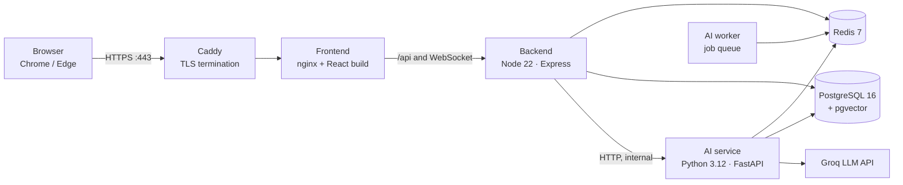

# Deployment Report: Communication Readiness Platform

**Date:** 8 October 2026 · **Status:** Live, all 7 services healthy
**URL:** https://13-235-229-218.sslip.io

| Went live | Region | Server | HTTPS certificate | Memory in use | Disk in use |
|---|---|---|---|---|---|
| 8 Oct 2026, 01:16 IST | ap-south-1 (Mumbai) | EC2 t4g.small · Arm | Let's Encrypt, to 5 Jan 2027 | ≈ 380 MB of 1.8 GB | 11 GB of 29 GB |

The full platform runs on one AWS EC2 server in Mumbai behind automatic HTTPS, and it passed every live test, including complete AI mock interviews. The step-by-step setup guide is [DEPLOYMENT.md](../DEPLOYMENT.md).

---

## 1. Access and accounts

Open the site in **Chrome or Edge** on a laptop and allow the microphone. Speech is transcribed by the browser's own speech recognition, which Firefox and Safari do not provide.

| Login | Role | Use it for |
|---|---|---|
| `alice@demo.local` | Student | Mock interview, report, coins. Clean history. |
| `charlie@demo.local` | Student | Second student. Holds the test interviews from verification. |
| `bob@demo.local` | Faculty mentor | Assigned students, resume verification. |
| `admin@demo.local` | Program admin | Adding students and staff, restoring coins. |

All demo accounts use the password `Password123!`, which is published in this repository, so they are for testing and the demo only. Two people must not use the same student account at once: starting an interview cancels any interview already running on that account.

## 2. Architecture

Everything runs as Docker containers on a single server, managed by Docker Compose. Only Caddy is reachable from the internet. It holds the HTTPS certificate and passes traffic to the frontend container. nginx in that container serves the React app and forwards `/api` and the interview WebSocket to the backend.



- **Interview flow:** the browser streams each answer's transcript and speech timing over a secure WebSocket to the backend. The backend asks the AI service to score the answer and choose the next question, then sends the result back on the same connection.
- **Scoring:** Overall = 70% technical + 30% communication. Communication combines fluency, speaking pace, filler words and clarity. Technical blends the AI's score with how many key points the answer covered.
- **State:** interview state is held in Redis and written through to PostgreSQL, so a dropped connection can resume where it left off.

## 3. Infrastructure

| Item | Value |
|---|---|
| Cloud / region | AWS, ap-south-1 (Mumbai), zone ap-south-1c |
| Instance | `i-0da739164118a2a47` · *communication-readiness-prod* |
| Type | t4g.small: 2 Arm (Graviton) vCPUs, 2 GB RAM, plus a 4 GB swap file |
| Operating system | Ubuntu Server 24.04.4 LTS (aarch64) |
| Disk | 30 GB gp3 (29 GB usable, 11 GB used) |
| Container runtime | Docker 29.1.3, Docker Compose 2.40.3 |
| Open ports | 22 (SSH, key only), 80 (redirects to HTTPS), 443 (HTTPS). Backend, AI service, database and Redis are not reachable from outside. |
| Address | Public IP `13.235.229.218`. **Not an Elastic IP.** |
| Host name | `13-235-229-218.sslip.io`: a free wildcard DNS name that always resolves to the IP written in it |
| HTTPS | Let's Encrypt certificate obtained by Caddy, valid 7 Oct 2026 to 5 Jan 2027, renewed automatically about 30 days before expiry |
| Code location | `/opt/pcp` on the server |

## 4. Services

Memory was measured with everything idle shortly after the live tests. All four application images were built on the server from this repository.

| Service | Image | Size | Role | Health check | Memory |
|---|---|---|---|---|---|
| caddy | `caddy:2-alpine` | 89 MB | HTTPS, certificate, redirect from HTTP | — | 13 MB |
| frontend | `local/communication-readiness-frontend` | 96 MB | React app, proxy for `/api` and the WebSocket | page loads | 7 MB |
| backend | `local/communication-readiness-backend` | 456 MB | API, auth, live interview gateway, coins | `/api/health` | 62 MB |
| ai-service | `local/communication-readiness-ai` | 921 MB | Answer scoring, next question, learning plans | `/health` | 96 MB |
| ai-worker | same as ai-service | — | Background jobs from the queue | — | 33 MB |
| db | `pgvector/pgvector:pg16` | 650 MB | PostgreSQL 16 with vector search | `pg_isready` | 165 MB |
| redis | `redis:7-alpine` | 59 MB | Interview state, cache, job queue (password protected) | `ping` | 5 MB |

## 5. Configuration and secrets

All settings live in `/opt/pcp/.env.production`, readable only by the server's `ubuntu` account (mode 600). Passwords and signing keys were generated on the server with `openssl rand` and have never been stored anywhere else. None are in this repository. The template is [.env.production.example](../.env.production.example).

| Setting | Purpose | Value / source |
|---|---|---|
| `SITE_ADDRESS`, `CORS_ORIGIN`, `APP_URL` | Public address for HTTPS, allowed browser origin, links in e-mails | `13-235-229-218.sslip.io` |
| `JWT_SECRET` | Signs login tokens | 64 random hex characters, generated on server |
| `AI_INTERNAL_KEY` | Shared secret between backend and AI service | Generated on server |
| `REDIS_PASSWORD` | Redis authentication | Generated on server |
| `POSTGRES_PASSWORD`, `DATABASE_URL` | Database login and connection | Generated on server; database runs in Docker |
| `LLM_PROVIDER`, `LLM_MODEL` | AI interviewer model | Groq, `openai/gpt-oss-120b` |
| `LLM_FALLBACK_MODELS` | Used when the main model's daily limit is reached | `openai/gpt-oss-20b`, `qwen/qwen3.8-27b` |
| `LLM_API_KEY`, `LLM_FALLBACK_API_KEYS` | LLM access | Temporary test keys |
| `TRUST_PROXY` | Reads the visitor's real IP through Caddy and nginx | `2` |
| `SEED_DEMO_DATA` | Loads the demo accounts | `true` |
| `COMPOSE_PROFILES` | Runs the database container on this server | `local-db` |
| `DEEPGRAM_API_KEY`, `SMTP_*` | Server speech-to-text; e-mail | Not set: browser speech recognition is used, and admins see temporary passwords on screen |

## 6. Data and storage

Persistent data lives in Docker volumes on the server's disk. Rebuilding or restarting containers keeps them. Deleting the volumes, or terminating the instance, loses them.

| Volume | Contents |
|---|---|
| `pcp_pg_data` | The database: users, students, interviews, reports, coins, learning plans |
| `pcp_redis_data` | Live interview state and cache |
| `pcp_backend_uploads` | Uploaded resume PDFs |
| `pcp_caddy_data`, `pcp_caddy_config` | HTTPS certificate and its account |

- **Schema:** all 85 of 85 migrations applied, including the demo seed.
- **Accounts:** 4 users (1 program admin, 1 faculty mentor, 2 students). Each student starts with 5 coins.
- **Backups:** none are configured yet (see Open risks).

## 7. How it was deployed

The images were built on the server itself, so the deployment needed no Docker Hub account, GitHub Actions run or AWS Secrets Manager setup.

1. **Instance launched** from the AWS console: Ubuntu 24.04 Arm, t4g.small, 30 GB disk, with SSH, HTTP and HTTPS allowed in the security group.
2. **Server prepared:** checked that Docker and Compose were present, added a 4 GB swap file (made permanent in `/etc/fstab`), created `/opt/pcp`.
3. **Code uploaded** over SSH as a compressed archive. Dependencies, local builds, git history and every `.env` file were excluded.
4. **Configuration written** on the server with fresh random secrets. Only the LLM settings were copied from the development machine.
5. **Firewall checked** from outside: ports 80 and 443 reachable.
6. **Build and start** with [`deploy/server-deploy.sh`](../deploy/server-deploy.sh): build the images, start the database, run migrations, start all services and wait until each reports healthy. The first attempt stopped because two services tried to build the same image at once. After a one-line fix it completed in about 10 minutes (live at 01:16 IST).
7. **HTTPS issued:** Caddy obtained the Let's Encrypt certificate within seconds.
8. **Live verification** from outside the server (next section).

## 8. Verification

### On the live site

| Check | Result | Detail |
|---|---|---|
| HTTPS health endpoint | Pass | `/api/health` returns `status: ok`, `env: production` |
| Home page over HTTPS | Pass | HTTP 200 with a valid certificate |
| Coins, end to end | 14 / 14 | Charge on start, +2 on fair completion capped at 5, no double rewards, 402 when empty, student cannot self-restore, admin restore |
| Interview follows the answer | Pass | After a vague intro, the AI asked about Django models, which came from the candidate's resume |
| Time runs out mid-answer | Pass | Last answer scored, report produced (2 of 10 answered, overall 37) |
| Tab-switch proctoring | Pass | Warnings at switches 1–3, disqualified at the 4th |
| Reconnect after disqualification | Pass | Refused with code 4409, "This interview has already finished" |

### Before deployment

| Component | Result | Detail |
|---|---|---|
| Backend | 87 / 87 tests | Type check and production build pass; interview scoring and module 3 suites |
| Frontend | Pass | Type check and production build |
| AI service | 436 / 436 tests | Clean environment with the slimmed dependency list; all 10 API routes load |
| Interview edge cases | Pass | Resume grounding, time-up with and without answers, proctoring, AI outage and recovery |
| Legacy backend tests | Not run | 5 older suites are written for Vitest, which was never installed (predates this work) |

## 9. Problems found and fixed

| Problem | Effect | Fix |
|---|---|---|
| Frontend image built without its nginx configuration | `/api` calls never reached the backend, so **login failed** | Image now includes the config that proxies the API and WebSocket |
| Backend not published and no proxy in the compose file | Nothing answered on the public port; deploy health check failed | Caddy and frontend added to the stack; backend reachable only through them |
| No HTTPS | Browsers block the microphone, so **the mock interview could not work** | Caddy with automatic Let's Encrypt certificates |
| AI service published on port 8000 | Anyone could call the LLM endpoints and spend the API quota | AI service is internal only |
| nginx 60-second idle timeout | Live interview connection dropped during long answers | 1-hour timeout on the interview route, plus a server ping every 25 seconds |
| nginx 1 MB upload limit | Resume PDFs over 1 MB rejected | Limit raised to 10 MB (the backend allows 5 MB) |
| nginx kept the backend's old address | "502 Bad Gateway" after the backend restarted | Address looked up again on each request |
| Browsers cached the old `index.html` | Blank page after a redeploy | `index.html` is always revalidated |
| Database SSL settings mishandled | Hosted databases (Supabase, RDS) refused connections; migration scripts had no SSL | One shared connection helper for the app and every script |
| Migrations failed on databases that already had some tables | Deploy stopped at the migration step | Migrations made safe to re-run, plus a reconcile migration |
| All visitors looked like one IP behind the proxy | Login throttling could not tell visitors apart | Proxy hops are trusted, so the real visitor IP is used |
| AI image carried about 2 GB of unused machine-learning packages | Slow builds, larger memory use | Moved to optional `requirements-ml.txt`; AI service idles at 96 MB |
| A fresh production database has no accounts | Nobody can log in | Demo seed flag and a `create-owner` command |
| Coins kept only in the browser | Coins reset or could be edited by students | Coins moved to the server's credit ledger |

## 10. Open risks

| Severity | Risk | What to do |
|---|---|---|
| High | The public IP is not an Elastic IP. Stopping and starting the instance changes it, and the site address is built from it. | Allocate and associate an Elastic IP, update the three address settings and restart. Until then, do not stop the instance. |
| High | No database backups. All data sits on one disk. | Schedule a nightly `pg_dump` (see runbook) or EBS snapshots with AWS Data Lifecycle Manager. |
| Medium | The LLM runs on temporary Groq test keys with daily token limits. When the limit is reached, the interviewer falls back to generic questions without showing an error. | Install the production LLM key before the demo and run one practice interview. |
| Medium | Demo accounts with a published password are active on a public site. | After the demo, change their passwords or disable them, and create real accounts. |
| Medium | One small server: no redundancy, and load beyond a few simultaneous interviews is untested. | Watch memory during the demo. Upgrading to t4g.medium is a stop, a type change and a start (needs the Elastic IP first). |
| Low | Speech recognition works only in Chrome and Edge. | Add a Deepgram key for server-side speech-to-text in every browser. |
| Low | The host name depends on sslip.io, a free third-party service. | For a permanent address, point a real domain at the server and change `SITE_ADDRESS`. |
| Low | No uptime monitoring or alerts. | Add a free uptime check on `/api/health`. |

## 11. Before the demo

- [ ] Attach an Elastic IP and switch the site address to it
- [ ] Install the production LLM key, then run a practice interview and check that follow-ups refer to what was said
- [ ] Rehearse on the demo laptop in Chrome with the actual microphone and network
- [ ] Create fresh student accounts for judges and teammates, so nobody shares an account during the demo
- [ ] Take a database backup right before the demo

## 12. Operations runbook

Connect with the `pcp-production-key.pem` key, then work from `/opt/pcp`. Every command below assumes the `dc` shortcut from the first block.

**Connect and set the shortcut**
```bash
ssh -i pcp-production-key.pem ubuntu@13.235.229.218
cd /opt/pcp
alias dc='docker compose -f docker-compose.prod.yml -f docker-compose.build.yml --env-file .env.production'
```

**Status and logs**
```bash
dc ps
dc logs -f --tail=100 backend ai-service
```

**Deploy a code update** (on the development machine, in the project folder, using Git Bash)
```bash
tar --exclude=node_modules --exclude=dist --exclude=.venv --exclude=.git \
    --exclude='.env*' --exclude=uploads --exclude=__pycache__ --exclude='*.zip' -czf - . \
  | ssh -i pcp-production-key.pem ubuntu@13.235.229.218 'tar -xzf - -C /opt/pcp'
ssh -i pcp-production-key.pem ubuntu@13.235.229.218 'cd /opt/pcp && bash deploy/server-deploy.sh'
```

**Change the LLM key or the site address**
```bash
nano .env.production        # edit LLM_API_KEY, or SITE_ADDRESS / CORS_ORIGIN / APP_URL
dc up -d                    # recreates only the services whose settings changed
```

**Back up the database**
```bash
dc exec -T db pg_dump -U postgres -Fc comm_readiness > ~/backup-$(date +%F).dump
```

**Give every student 5 coins again**
```bash
dc run --rm --no-deps backend npm run restore-coins
```

**Create a platform owner account**
```bash
dc run --rm --no-deps backend npm run create-owner -- you@example.com "Your Name"
```

**Restart one service**
```bash
dc restart backend          # or ai-service, frontend, caddy
```

| Symptom | Check |
|---|---|
| Site does not open | `dc ps`: all healthy? `dc logs caddy`: certificate errors? Has the IP changed? |
| Login shows a network error | `curl https://13-235-229-218.sslip.io/api/health`, then `dc logs backend` |
| Microphone blocked | The page must be HTTPS, in Chrome or Edge, with microphone permission granted |
| Interviewer asks generic questions | LLM key missing, invalid or over its daily limit: `dc logs ai-service` |
| 502 Bad Gateway | `dc ps`, then `dc logs backend frontend` |
| Disk filling up | `df -h /`, then `docker builder prune -f` and `docker image prune -f` |
